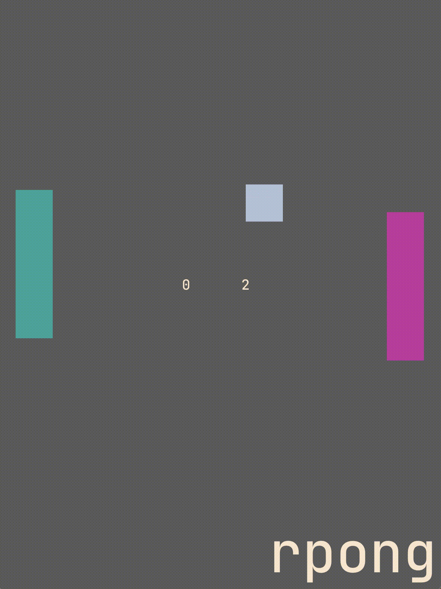

###Genesis
Rpong is my first venture into learning *bevy* and *ecs*. The purpose was not to
make the next bestseller, or even to have any body else playt the game. I wanted to 
dive into the deep ocean of Rust game development by make something that works-ish.
Do to this design, minimal effort was taken with code and refactoring. 

Belows is a clip of me playing the game (looks much more lagy in the gif than it really is).
The controls are W,S for player one and UpArrow,DownArrow for player two. 

###Takeaways
Bevy has a lot of meat to it, but it is also elegent and lightweight when you don't know what you 
are doing. It reminds me of chess, a game which rewards tactics, strategic outlets, and in-depth analysis,
BUT can also be played casually and very simply by those who are curious enough to try it.
I will be looking more into bevy in the coming weeks to explore this rich ecosystem of game development using Rust!
